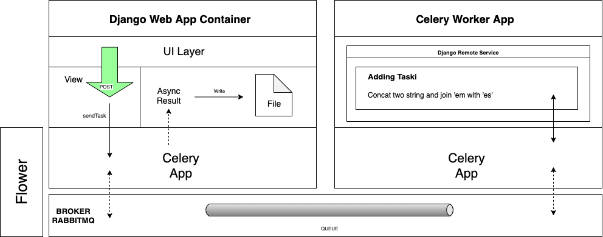

# django-rabbitmq-celery
Code example to communicate two different Django Projects through RabbitMq as Broker and Celery as Task Runner

Default User for rabbitmq server is django and also the password.
The Rabbitmq vhost is rabbit
By default user django has the "management" role.

If you want change this, you need to enter to the rabbitmq-server container to bash command line and write:

rabbitmqctl add_user user_you_want user_password 
rabbitmqctl add_vhost v_host_name_you_want 
rabbitmqctl set_permissions -p v_host_name_you_want user_you_want ".*" ".*" ".*" 
rabbitmqctl set_user_tags user_you_want management 
 

To run the project and launch all containers type:  

<b>docker-compose up</b>
 

Here is a diagram with overall process involving all the components.

   

 
  <h2>How does it work?</h2>
  
   
  
User opens the django web app by going to http://localhost:8000, you must fill both text input fields with random text. Hitting the submit button it will post the data to the views.py file and post action. After validating the form data, it will use the app.send_task() method and invoking the 'adding_taski' task by passing the string parameters.

We store the result in a variable which will be used later to fetch the task result.

At this point Celery received the message and routed it to a queue. In the other side the remote service app has been loaded by celery as a worker by executing this command in the docker-compose.yml file:

celery -A rabbitmq_celery worker -l info
